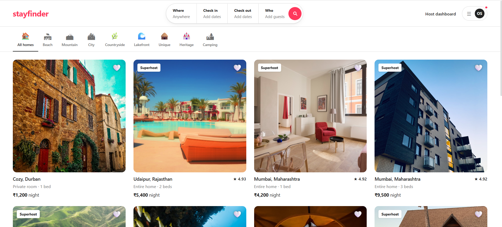
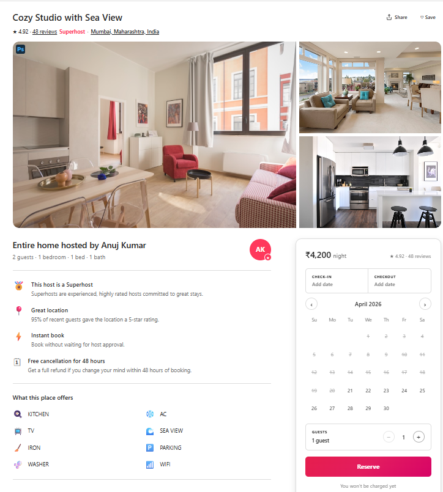
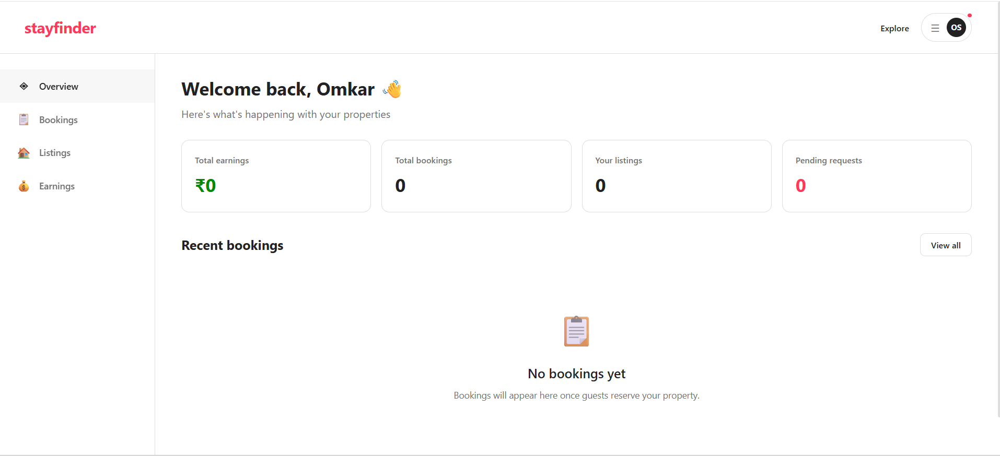
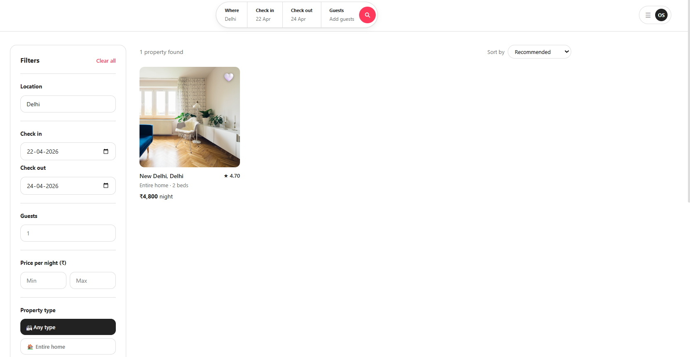
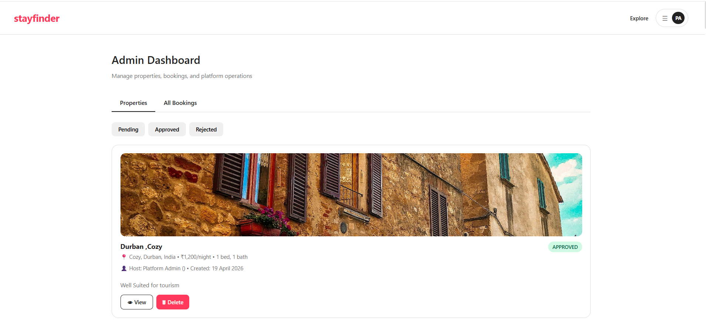
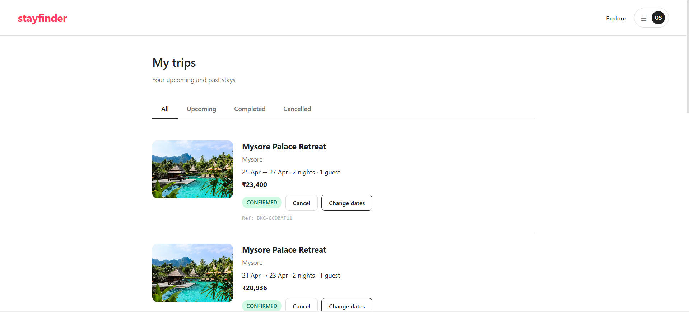

<div align="center">


<br/><br/>

```
███████╗████████╗ █████╗ ██╗   ██╗███████╗██╗███╗   ██╗██████╗ ███████╗██████╗
██╔════╝╚══██╔══╝██╔══██╗╚██╗ ██╔╝██╔════╝██║████╗  ██║██╔══██╗██╔════╝██╔══██╗
███████╗   ██║   ███████║ ╚████╔╝ █████╗  ██║██╔██╗ ██║██║  ██║█████╗  ██████╔╝
╚════██║   ██║   ██╔══██║  ╚██╔╝  ██╔══╝  ██║██║╚██╗██║██║  ██║██╔══╝  ██╔══██╗
███████║   ██║   ██║  ██║   ██║   ██║     ██║██║ ╚████║██████╔╝███████╗██║  ██║
╚══════╝   ╚═╝   ╚═╝  ╚═╝   ╚═╝   ╚═╝     ╚═╝╚═╝  ╚═══╝╚═════╝ ╚══════╝╚═╝  ╚═╝
```

### 🏠 A full-stack Airbnb-inspired property rental platform
### *Real-time notifications · JWT auth · Cloudinary uploads · Email alerts · Admin panel · PWA · Map view · Chat*

<br/>

[🚀 Quick Start](#-quick-start) · [✨ Features](#-features) · [🏗 Architecture](#-architecture) · [📡 API Reference](#-api-reference) · [🛠 Tech Stack](#-tech-stack) · [📸 Screenshots](#-screenshots)

</div>

---

## 📖 Overview

**StayFinder** is a production-grade Airbnb clone built with **Spring Boot 3** and **Vanilla JS**. It implements the complete rental marketplace workflow — from property listing and approval to booking, review, real-time notifications, and host/guest chat — with a clean REST API, WebSocket push, map view, PWA support, and a responsive frontend served through nginx.

> Built as a full-stack portfolio project demonstrating enterprise Java patterns, security best practices, real-time communication, and modern frontend architecture.

---

## ✨ Features

### 🔐 Authentication & Security
| Feature | Detail |
|---|---|
| JWT Authentication | Access token (24h) + Refresh token (7 days) |
| Role-based Access | `GUEST` · `HOST` · `ADMIN` |
| XSS Protection | All user input sanitized before rendering |
| Secure Password | BCrypt with strength 12 |
| Token Refresh | Auto-refresh on 401 with silent retry |
| Forgot Password | Email-based password reset with 1-hour expiry token |
| Env-based Secrets | All credentials loaded from `.env` — never hardcoded |

### 🏠 Property Management
| Feature | Detail |
|---|---|
| Create Listings | Full property form with amenities, pricing, house rules |
| Cloudinary Upload | Direct browser-to-cloud image upload (up to 5 photos) |
| Admin Approval | Properties go through PENDING → APPROVED/REJECTED workflow |
| Availability Calendar | Block/unblock dates with custom pricing |
| Category Filtering | Beach · Mountain · City · Countryside · Lakefront · Unique · Heritage · Camping |
| Instant Book | Toggle between instant confirmation or host approval |
| Weekend Pricing | Separate weekend rate support |
| Long-stay Discount | Automatic discount for 7+ night stays |
| Map View | Interactive Leaflet.js map with price pins on search page |
| Auto Coordinates | Lat/lng auto-filled from city name on property creation |

### 📅 Booking System
| Feature | Detail |
|---|---|
| Create Booking | Date conflict detection with DB-level validation |
| Modify Booking | Change dates/guests with live price recalculation |
| Cancel Booking | Guest cancellation with host notification |
| Auto-complete | Scheduler marks past bookings COMPLETED daily at 1 AM |
| Price Preview | Real-time price breakdown before confirming |
| Booking Reference | Unique `BKG-XXXXXXXX` reference ID per booking |
| Can Review Flag | Automatically set when checkout date passes |

### 💬 Host/Guest Messaging
| Feature | Detail |
|---|---|
| Real-time Chat | WebSocket-powered chat between host and guest per booking |
| Message History | Full conversation history per booking |
| Unread Count | Live unread message indicator |
| Instant Delivery | Messages delivered in real-time via STOMP |

### ⭐ Reviews & Ratings
| Feature | Detail |
|---|---|
| 6-category Rating | Cleanliness · Communication · Check-in · Location · Value · Accuracy |
| Verified Reviews | Only guests with completed bookings can review |
| Auto Rating Update | Property avg rating recalculated on every new review |
| Rating Summary | Per-category breakdown with progress bars |
| Show More | First 4 reviews shown, expandable with "Show all" button |

### 🔔 Real-time Notifications
| Feature | Detail |
|---|---|
| WebSocket / STOMP | Real-time push via SockJS + STOMP |
| Email Notifications | HTML email templates via Gmail SMTP |
| Notification Types | Booking confirmed · cancelled · modified · new request · property approved/rejected · new review |
| Unread Count | Live badge on navbar updates in real-time |
| Mark All Read | Single-click clear all notifications |

### 🗺 Map & Search
| Feature | Detail |
|---|---|
| Map View | Toggle between grid and map on search page |
| Price Pins | Each property shows price pin on map |
| City Autocomplete | 20 Indian cities with instant suggestions |
| Price Range Slider | Visual dual-handle range slider for price filter |
| Infinite Scroll | Auto-loads more properties on scroll |
| Inspiration Section | Horizontal scrollable city cards on home page |

### 🛠 Admin Panel
| Feature | Detail |
|---|---|
| Property Moderation | Approve / Reject / Delete any property |
| All Bookings View | Platform-wide booking overview |
| Role Protection | Frontend + backend both enforce `ADMIN` role |
| Notification on Action | Host emailed and notified on approval/rejection |

### 🏡 Host Dashboard
| Feature | Detail |
|---|---|
| Overview Stats | Total earnings · bookings · listings · pending requests |
| Booking Management | Approve / decline guest requests with one click |
| Listings Management | View all your properties with status and ratings |
| Earnings Breakdown | Total earned · this month · completed stays |
| Message Guests | Direct chat button on each booking row |

### 🔍 Search & Discovery
| Feature | Detail |
|---|---|
| Dedicated Search Page | `pages/search.html` with sidebar filters |
| Advanced Filters | City · dates · guests · price range · property type · category |
| URL-synced State | Shareable search URLs with all filters encoded |
| Recently Viewed | Last 6 viewed properties shown on home page |
| Wishlist Toggle | Save/unsave directly from search results |

### 📱 PWA & UX
| Feature | Detail |
|---|---|
| PWA | Installable on Android/iOS — works like a native app |
| Offline Support | CSS, JS, HTML cached via service worker |
| Dark Mode | Full dark theme toggle — persists across sessions |
| Photo Lightbox | Full-screen gallery with keyboard navigation |
| Image Carousel | Swipeable photo carousel on property cards |
| Scroll Reveal | Cards animate in as you scroll |
| Top Progress Bar | Thin red bar shows API loading state |
| Smooth Animations | Heart bounce, blur-to-sharp images, page fade-in |

---

## 🏗 Architecture

```
┌─────────────────────────────────────────────────────────────────┐
│                         Browser Client                          │
│    Vanilla JS · SockJS · STOMP · Cloudinary · Leaflet.js        │
└──────────────────────────┬──────────────────────────────────────┘
                           │ HTTP / WebSocket
                           ▼
┌─────────────────────────────────────────────────────────────────┐
│                        nginx :3000                              │
│   /api/*  →  Spring Boot :8080    /ws  →  Spring Boot :8080     │
│   /*      →  Static frontend files                              │
└──────────────────────────┬──────────────────────────────────────┘
                           │
                           ▼
┌─────────────────────────────────────────────────────────────────┐
│                    Spring Boot :8080                            │
│                                                                 │
│  ┌──────────┐  ┌──────────┐  ┌──────────┐  ┌──────────────┐   │
│  │   Auth   │  │ Property │  │ Booking  │  │ Notification │   │
│  │Controller│  │Controller│  │Controller│  │  Controller  │   │
│  └────┬─────┘  └────┬─────┘  └────┬─────┘  └──────┬───────┘   │
│  ┌────┴─────┐  ┌────┴─────┐                                    │
│  │ Message  │  │  Review  │                                    │
│  │Controller│  │Controller│                                    │
│  └──────────┘  └──────────┘                                    │
│  ┌────────────────────────────────────────────────────────┐    │
│  │                    Service Layer                        │    │
│  │  AuthService · BookingService · PropertyService         │    │
│  │  ReviewService · NotificationService · EmailService     │    │
│  │  MessageService                                         │    │
│  └────────────────────────┬───────────────────────────────┘    │
│  ┌────────────────────────▼───────────────────────────────┐    │
│  │              Spring Data JPA Repositories               │    │
│  └────────────────────────┬───────────────────────────────┘    │
│  ┌──────────────┐  ┌──────▼──────────┐  ┌──────────────┐      │
│  │  JWT Filter  │  │  PostgreSQL      │  │ JavaMail     │      │
│  │  + Security  │  │  + Flyway V1-V4  │  │ Gmail SMTP   │      │
│  └──────────────┘  └─────────────────┘  └──────────────┘      │
└─────────────────────────────────────────────────────────────────┘
                           │
                           ▼
              ┌────────────────────────┐
              │      Cloudinary CDN    │
              │   (Property Images)    │
              └────────────────────────┘
```

---

## 🛠 Tech Stack

### Backend
| Technology | Version | Purpose |
|---|---|---|
| Java | 21 | Language (Virtual Threads enabled) |
| Spring Boot | 3.2.0 | Application framework |
| Spring Security | 6.2 | Authentication & authorization |
| Spring Data JPA | 3.2 | Database ORM |
| Spring WebSocket | 3.2 | Real-time notifications + chat |
| Spring Mail | 3.2 | Email via Gmail SMTP |
| SpringDoc OpenAPI | 2.3.0 | Swagger UI at `/swagger-ui/index.html` |
| PostgreSQL | 16 | Primary database |
| Flyway | 9 | Database migrations (V1→V4) |
| jjwt | 0.12.3 | JWT token generation & validation |
| Lombok | Latest | Boilerplate reduction |
| BCrypt | - | Password hashing (strength 12) |
| JUnit 5 + Mockito | - | Unit tests for AuthService & BookingService |

### Frontend
| Technology | Purpose |
|---|---|
| Vanilla JS (ES2022) | No framework — clean, fast, zero dependencies |
| SockJS + STOMP.js | WebSocket client for real-time notifications & chat |
| Cloudinary JS API | Direct browser image upload |
| Leaflet.js 1.9.4 | Interactive map view with property price pins |
| CSS Variables | Consistent theming + dark mode support |

### Infrastructure
| Technology | Purpose |
|---|---|
| Docker + Compose | Multi-service containerization |
| nginx | Reverse proxy + static file serving |
| Cloudinary | Cloud image storage & CDN |
| Gmail SMTP | Transactional email delivery |
| PWA (manifest + sw.js) | Installable app with offline support |

---

## 🚀 Quick Start

### Option 1 — Docker (Recommended)

```bash
# Clone the repository
git clone https://github.com/omkarshetake/stayfinder.git
cd stayfinder

# Copy and configure environment
cp .env.example .env
# Edit .env with your credentials

# Start all services
docker-compose up --build
```

Open **http://localhost:3000** 🎉

### Option 2 — Local Development

**Prerequisites:** Java 21+, PostgreSQL 14+, Node.js (for serving frontend)

```bash
# 1. Start PostgreSQL and create database
createdb stayfinder_db

# 2. Configure environment
cp .env.example .env
# Fill in DB credentials, JWT secret, mail credentials

# 3. Start backend
cd backend
./mvnw spring-boot:run
# API available at http://localhost:8080/api/v1
# Swagger UI at http://localhost:8080/swagger-ui/index.html

# 4. Serve frontend (in new terminal)
cd frontend
npx serve . -p 5500
# Open http://localhost:5500
```

---

## 🔑 Demo Credentials

| Role | Email | Password | Access |
|---|---|---|---|
| 👤 Guest | `guest@stayfinder.com` | `Guest@123` | Browse, book, review, chat |
| 🏠 Host | `host@stayfinder.com` | `Admin@123` | List properties, manage bookings, chat |
| ⚙️ Admin | `admin@stayfinder.com` | `Admin@123` | Approve/reject/delete properties |

> Default users are auto-created on first startup via `@PostConstruct` in `AuthService`.

---

## ⚙️ Environment Variables

Create a `.env` file in the project root:

```env
# ── Database ──────────────────────────────────────
SPRING_DATASOURCE_URL=jdbc:postgresql://localhost:5432/stayfinder_db
SPRING_DATASOURCE_USERNAME=postgres
SPRING_DATASOURCE_PASSWORD=yourpassword

# ── JWT ───────────────────────────────────────────
JWT_SECRET=your-256-bit-secret-key-here-change-in-production

# ── Mail (Gmail App Password) ─────────────────────
MAIL_USERNAME=your-gmail@gmail.com
MAIL_PASSWORD=xxxxxxxxxxxxxxxxxxxx
MAIL_ENABLED=true
MAIL_FROM=StayFinder <noreply@stayfinder.com>

# ── Frontend URL (for password reset emails) ──────
FRONTEND_URL=https://your-frontend-url.onrender.com
```

> ⚠️ **Never commit `.env` to git.** It is listed in `.gitignore`.

---

## 📡 API Reference

### Auth
| Method | Endpoint | Auth | Description |
|---|---|---|---|
| `POST` | `/api/v1/auth/register` | ❌ | Register new user |
| `POST` | `/api/v1/auth/login` | ❌ | Login, get tokens |
| `POST` | `/api/v1/auth/refresh` | ❌ | Refresh access token |
| `GET` | `/api/v1/auth/me` | ✅ | Get current user |
| `POST` | `/api/v1/auth/become-host` | ✅ | Upgrade to host |
| `PATCH` | `/api/v1/auth/profile` | ✅ | Update profile |
| `POST` | `/api/v1/auth/forgot-password` | ❌ | Send reset email |
| `POST` | `/api/v1/auth/reset-password` | ❌ | Reset password with token |

### Properties
| Method | Endpoint | Auth | Description |
|---|---|---|---|
| `GET` | `/api/v1/properties/search` | ❌ | Search with filters |
| `GET` | `/api/v1/properties/{id}` | ❌ | Get property detail |
| `GET` | `/api/v1/properties/{id}/availability` | ❌ | Get availability |
| `POST` | `/api/v1/host/properties` | ✅ HOST | Create listing |
| `GET` | `/api/v1/host/properties` | ✅ HOST | My listings |
| `PUT` | `/api/v1/host/properties/{id}/availability` | ✅ HOST | Update availability |

### Bookings
| Method | Endpoint | Auth | Description |
|---|---|---|---|
| `POST` | `/api/v1/bookings` | ✅ | Create booking |
| `GET` | `/api/v1/bookings` | ✅ | My bookings |
| `PATCH` | `/api/v1/bookings/{id}/cancel` | ✅ | Cancel booking |
| `PATCH` | `/api/v1/bookings/{id}/modify` | ✅ | Modify dates/guests |
| `POST` | `/api/v1/bookings/price-preview` | ✅ | Calculate price |

### Messages
| Method | Endpoint | Auth | Description |
|---|---|---|---|
| `POST` | `/api/v1/messages` | ✅ | Send message |
| `GET` | `/api/v1/messages/booking/{id}` | ✅ | Get conversation |
| `GET` | `/api/v1/messages/unread/count` | ✅ | Unread count |

### Reviews
| Method | Endpoint | Auth | Description |
|---|---|---|---|
| `POST` | `/api/v1/reviews` | ✅ | Submit review |
| `GET` | `/api/v1/reviews/property/{id}` | ❌ | Get property reviews |
| `GET` | `/api/v1/reviews/property/{id}/summary` | ❌ | Rating summary |

### Admin
| Method | Endpoint | Auth | Description |
|---|---|---|---|
| `GET` | `/api/v1/admin/properties` | ✅ ADMIN | List by status |
| `PATCH` | `/api/v1/admin/properties/{id}/approve` | ✅ ADMIN | Approve property |
| `PATCH` | `/api/v1/admin/properties/{id}/reject` | ✅ ADMIN | Reject property |
| `DELETE` | `/api/v1/admin/properties/{id}` | ✅ ADMIN | Delete property |
| `GET` | `/api/v1/admin/bookings` | ✅ ADMIN | All bookings |

> 📖 Full interactive API docs available at `http://localhost:8080/swagger-ui/index.html`

---

## 📁 Project Structure

```
stayfinder/
├── backend/
│   └── src/
│       ├── main/java/com/stayfinder/
│       │   ├── config/
│       │   │   ├── SecurityConfig.java         # Spring Security + CORS + JWT
│       │   │   ├── JwtUtil.java                # Token generation & validation
│       │   │   ├── JwtAuthFilter.java          # Per-request auth filter
│       │   │   ├── WebSocketConfig.java        # STOMP broker configuration
│       │   │   ├── OpenApiConfig.java          # Swagger/OpenAPI configuration
│       │   │   └── RequestLoggingFilter.java   # Structured request logging
│       │   ├── controller/
│       │   │   ├── AuthController.java         # Auth + profile + password reset
│       │   │   ├── PropertyController.java     # Properties, wishlists, host, admin
│       │   │   ├── BookingController.java      # Bookings, host actions, admin
│       │   │   ├── ReviewController.java       # Reviews & rating summaries
│       │   │   ├── MessageController.java      # Host/guest chat
│       │   │   └── NotificationController.java
│       │   ├── service/
│       │   │   ├── AuthService.java            # Auth + forgot/reset password
│       │   │   ├── PropertyService.java        # Property CRUD + approval
│       │   │   ├── BookingService.java         # Booking logic + scheduler
│       │   │   ├── ReviewService.java          # Review + rating calculation
│       │   │   ├── MessageService.java         # Real-time chat
│       │   │   ├── NotificationService.java    # In-app + WebSocket notifications
│       │   │   └── EmailService.java           # HTML email templates
│       │   ├── entity/                         # JPA entities
│       │   ├── dto/                            # Request/Response DTOs
│       │   ├── repository/                     # Spring Data JPA interfaces
│       │   └── exception/                      # Global error handler
│       ├── test/java/com/stayfinder/service/
│       │   ├── AuthServiceTest.java            # 8 unit tests
│       │   └── BookingServiceTest.java         # 11 unit tests
│       └── resources/
│           └── db/migration/
│               ├── V1__init.sql                # Schema + seed data
│               ├── V2__add_property_coordinates.sql
│               ├── V3__add_messages_table.sql
│               └── V4__add_password_reset_tokens.sql
├── frontend/
│   ├── manifest.json                           # PWA manifest
│   ├── sw.js                                   # Service worker (offline support)
│   ├── index.html                              # Home page
│   ├── pages/
│   │   ├── property.html                       # Property detail + booking + lightbox
│   │   ├── search.html                         # Search + map view + filters
│   │   ├── trips.html                          # Guest bookings
│   │   ├── wishlist.html                       # Saved properties
│   │   ├── host.html                           # Host dashboard
│   │   ├── admin.html                          # Admin panel
│   │   ├── profile.html                        # User profile edit
│   │   ├── chat.html                           # Host/guest messaging
│   │   ├── forgot-password.html                # Password reset request
│   │   └── reset-password.html                 # New password form
│   ├── js/
│   │   ├── api.js                              # API client + token refresh
│   │   ├── auth.js                             # Auth state + navbar
│   │   ├── utils.js                            # Helpers + dark mode init
│   │   ├── search.js                           # Property grid + carousel
│   │   ├── property.js                         # Detail page + lightbox
│   │   ├── host.js                             # Host dashboard
│   │   └── websocket.js                        # WebSocket + chat handler
│   └── css/
│       ├── global.css                          # Variables + dark mode
│       ├── nav.css                             # Navbar + responsive
│       ├── search.css                          # Grid + carousel + map toggle
│       ├── property.css                        # Detail + lightbox + mobile bar
│       ├── host.css                            # Dashboard + responsive
│       └── auth.css                            # Auth modal styles
├── nginx.conf                                  # Reverse proxy configuration
├── docker-compose.yml                          # PostgreSQL + Backend + nginx
└── .env.example                                # Environment template
```

---

## 🔄 Key Workflows

### Property Listing Flow
```
Host creates property → Status: PENDING
Admin reviews in Admin Panel → APPROVED or REJECTED
If APPROVED → Property visible in search + map → Host notified by email + in-app
If REJECTED → Host notified with reason → Can resubmit
```

### Booking Flow
```
Guest selects dates → Price preview (base + cleaning + service fee)
Guest confirms → Conflict check against existing bookings
Instant Book → CONFIRMED immediately → Host + Guest notified
Request Book → PENDING → Host approves/declines → Guest notified
Checkout passes → Auto-complete scheduler marks COMPLETED
Guest can now leave a review + message host
```

### Password Reset Flow
```
User clicks "Forgot password?" → Enters email
Backend generates UUID token → Stores with 1hr expiry → Sends HTML email
User clicks reset link → Opens reset-password.html?token=...
User enters new password → Backend validates token → Updates password
All refresh tokens invalidated → User logs in with new password
```

### Token Refresh Flow
```
API call → 401 Unauthorized
api.js detects 401 → calls POST /auth/refresh with refresh token
New access token received → original request retried automatically
Refresh token expired → auth cleared → redirect to login
```

---

## 📸 Screenshots

| Home Page | Property Detail | Host Dashboard |
|---|---|---|
|  |  |  |

| Search Page | Admin Panel | My Trips |
|---|---|---|
|  |  |  |

---

## 🚧 Known Limitations

- No payment gateway (Stripe/Razorpay integration planned)
- Email requires Gmail App Password setup
- Map view requires properties to have lat/lng coordinates

---

## 🤝 Contributing

1. Fork the repository
2. Create your feature branch (`git checkout -b feature/AmazingFeature`)
3. Commit your changes (`git commit -m 'Add AmazingFeature'`)
4. Push to the branch (`git push origin feature/AmazingFeature`)
5. Open a Pull Request

---

## 📄 License

Distributed under the MIT License. See `LICENSE` for more information.

---

<div align="center">

**Built with ❤️ by Omkar Shetake**

[](https://github.com/omkarshetake)
[](https://www.linkedin.com/in/omkar-shetake-53356b285/)

*If this project helped you, please consider giving it a ⭐*

</div>

<br/><br/>

```
███████╗████████╗ █████╗ ██╗   ██╗███████╗██╗███╗   ██╗██████╗ ███████╗██████╗
██╔════╝╚══██╔══╝██╔══██╗╚██╗ ██╔╝██╔════╝██║████╗  ██║██╔══██╗██╔════╝██╔══██╗
███████╗   ██║   ███████║ ╚████╔╝ █████╗  ██║██╔██╗ ██║██║  ██║█████╗  ██████╔╝
╚════██║   ██║   ██╔══██║  ╚██╔╝  ██╔══╝  ██║██║╚██╗██║██║  ██║██╔══╝  ██╔══██╗
███████║   ██║   ██║  ██║   ██║   ██║     ██║██║ ╚████║██████╔╝███████╗██║  ██║
╚══════╝   ╚═╝   ╚═╝  ╚═╝   ╚═╝   ╚═╝     ╚═╝╚═╝  ╚═══╝╚═════╝ ╚══════╝╚═╝  ╚═╝
```

### 🏠 A full-stack Airbnb-inspired property rental platform
### *Real-time notifications · JWT auth · Cloudinary uploads · Email alerts · Admin panel*

<br/>

[🚀 Quick Start](#-quick-start) · [✨ Features](#-features) · [🏗 Architecture](#-architecture) · [📡 API Reference](#-api-reference) · [🛠 Tech Stack](#-tech-stack) · [📸 Screenshots](#-screenshots)

</div>

---

## 📖 Overview

**StayFinder** is a production-grade Airbnb clone built with **Spring Boot 3** and **Vanilla JS**. It implements the complete rental marketplace workflow — from property listing and approval to booking, review, and real-time notifications — with a clean REST API, WebSocket push, and a responsive frontend served through nginx.

> Built as a full-stack portfolio project demonstrating enterprise Java patterns, security best practices, real-time communication, and modern frontend architecture.

---

## ✨ Features

### 🔐 Authentication & Security
| Feature | Detail |
|---|---|
| JWT Authentication | Access token (24h) + Refresh token (7 days) |
| Role-based Access | `GUEST` · `HOST` · `ADMIN` |
| XSS Protection | All user input sanitized before rendering |
| Secure Password | BCrypt with strength 12 |
| Token Refresh | Auto-refresh on 401 with silent retry |
| Env-based Secrets | All credentials loaded from `.env` — never hardcoded |

### 🏠 Property Management
| Feature | Detail |
|---|---|
| Create Listings | Full property form with amenities, pricing, house rules |
| Cloudinary Upload | Direct browser-to-cloud image upload (up to 5 photos) |
| Admin Approval | Properties go through PENDING → APPROVED/REJECTED workflow |
| Availability Calendar | Block/unblock dates with custom pricing |
| Category Filtering | Beach · Mountain · City · Countryside · Lakefront · Unique · Heritage · Camping |
| Instant Book | Toggle between instant confirmation or host approval |
| Weekend Pricing | Separate weekend rate support |
| Long-stay Discount | Automatic discount for 7+ night stays |

### 📅 Booking System
| Feature | Detail |
|---|---|
| Create Booking | Date conflict detection with DB-level validation |
| Modify Booking | Change dates/guests with live price recalculation |
| Cancel Booking | Guest cancellation with host notification |
| Auto-complete | Scheduler marks past bookings COMPLETED daily at 1 AM |
| Price Preview | Real-time price breakdown before confirming |
| Booking Reference | Unique `BKG-XXXXXXXX` reference ID per booking |
| Can Review Flag | Automatically set when checkout date passes |

### ⭐ Reviews & Ratings
| Feature | Detail |
|---|---|
| 6-category Rating | Cleanliness · Communication · Check-in · Location · Value · Accuracy |
| Verified Reviews | Only guests with completed bookings can review |
| Auto Rating Update | Property avg rating recalculated on every new review |
| Rating Summary | Per-category breakdown with progress bars |

### 🔔 Real-time Notifications
| Feature | Detail |
|---|---|
| WebSocket / STOMP | Real-time push via SockJS + STOMP |
| Email Notifications | HTML email templates via Gmail SMTP |
| Notification Types | Booking confirmed · cancelled · modified · new request · property approved/rejected · new review |
| Unread Count | Live badge on navbar updates in real-time |
| Mark All Read | Single-click clear all notifications |

### 🛠 Admin Panel
| Feature | Detail |
|---|---|
| Property Moderation | Approve / Reject / Delete any property |
| All Bookings View | Platform-wide booking overview |
| Role Protection | Frontend + backend both enforce `ADMIN` role |
| Notification on Action | Host emailed and notified on approval/rejection |

### 🏡 Host Dashboard
| Feature | Detail |
|---|---|
| Overview Stats | Total earnings · bookings · listings · pending requests |
| Booking Management | Approve / decline guest requests with one click |
| Listings Management | View all your properties with status and ratings |
| Earnings Breakdown | Total earned · this month · completed stays |
| Paginated Tables | Bookings and listings both paginated |

### 🔍 Search & Discovery
| Feature | Detail |
|---|---|
| Dedicated Search Page | `pages/search.html` with sidebar filters |
| Advanced Filters | City · dates · guests · price range · property type · category |
| URL-synced State | Shareable search URLs with all filters encoded |
| Paginated Results | 12 per page with prev/next navigation |
| Wishlist Toggle | Save/unsave directly from search results |

---

## 🏗 Architecture

```
┌─────────────────────────────────────────────────────────────────┐
│                         Browser Client                          │
│              Vanilla JS · SockJS · STOMP · Cloudinary           │
└──────────────────────────┬──────────────────────────────────────┘
                           │ HTTP / WebSocket
                           ▼
┌─────────────────────────────────────────────────────────────────┐
│                        nginx :3000                              │
│   /api/*  →  Spring Boot :8080    /ws  →  Spring Boot :8080     │
│   /*      →  Static frontend files                              │
└──────────────────────────┬──────────────────────────────────────┘
                           │
                           ▼
┌─────────────────────────────────────────────────────────────────┐
│                    Spring Boot :8080                            │
│                                                                 │
│  ┌──────────┐  ┌──────────┐  ┌──────────┐  ┌──────────────┐   │
│  │   Auth   │  │ Property │  │ Booking  │  │ Notification │   │
│  │Controller│  │Controller│  │Controller│  │  Controller  │   │
│  └────┬─────┘  └────┬─────┘  └────┬─────┘  └──────┬───────┘   │
│       │              │              │                │           │
│  ┌────▼─────────────────────────────────────────────▼───────┐   │
│  │                    Service Layer                          │   │
│  │  AuthService · BookingService · PropertyService           │   │
│  │  ReviewService · NotificationService · EmailService       │   │
│  └────────────────────────────┬──────────────────────────────┘   │
│                               │                                 │
│  ┌────────────────────────────▼──────────────────────────────┐   │
│  │              Spring Data JPA Repositories                  │   │
│  └────────────────────────────┬──────────────────────────────┘   │
│                               │                                 │
│  ┌──────────────┐  ┌──────────▼──────────┐  ┌──────────────┐  │
│  │  JWT Filter  │  │    PostgreSQL :5432  │  │ JavaMail     │  │
│  │  + Security  │  │    + Flyway Migrate  │  │ Gmail SMTP   │  │
│  └──────────────┘  └─────────────────────┘  └──────────────┘  │
└─────────────────────────────────────────────────────────────────┘
                           │
                           ▼
              ┌────────────────────────┐
              │      Cloudinary CDN    │
              │   (Property Images)    │
              └────────────────────────┘
```

---

## 🛠 Tech Stack

### Backend
| Technology | Version | Purpose |
|---|---|---|
| Java | 21 | Language (Virtual Threads enabled) |
| Spring Boot | 3.2.0 | Application framework |
| Spring Security | 6.2 | Authentication & authorization |
| Spring Data JPA | 3.2 | Database ORM |
| Spring WebSocket | 3.2 | Real-time notifications |
| Spring Mail | 3.2 | Email via Gmail SMTP |
| PostgreSQL | 16 | Primary database |
| Flyway | 9 | Database migrations |
| jjwt | 0.12.3 | JWT token generation & validation |
| Lombok | Latest | Boilerplate reduction |
| BCrypt | - | Password hashing (strength 12) |

### Frontend
| Technology | Purpose |
|---|---|
| Vanilla JS (ES2022) | No framework — clean, fast, zero dependencies |
| SockJS + STOMP | WebSocket client for real-time notifications |
| Cloudinary JS API | Direct browser image upload |
| CSS Variables | Consistent theming across all pages |

### Infrastructure
| Technology | Purpose |
|---|---|
| Docker + Compose | Multi-service containerization |
| nginx | Reverse proxy + static file serving |
| Cloudinary | Cloud image storage & CDN |
| Gmail SMTP | Transactional email delivery |

---

## 🚀 Quick Start

### Option 1 — Docker (Recommended)

```bash
# Clone the repository
git clone https://github.com/Omkar Shetake/stayfinder.git
cd stayfinder

# Copy and configure environment
cp .env.example .env
# Edit .env with your credentials

# Start all services
docker-compose up --build
```

Open **http://localhost:3000** 🎉

### Option 2 — Local Development

**Prerequisites:** Java 21+, PostgreSQL 14+, Node.js (for serving frontend)

```bash
# 1. Start PostgreSQL and create database
createdb stayfinder_db

# 2. Configure environment
cp .env.example .env
# Fill in DB credentials, JWT secret, mail credentials

# 3. Start backend
cd backend
./mvnw spring-boot:run
# API available at http://localhost:8080/api/v1

# 4. Serve frontend (in new terminal)
cd frontend
npx serve . -p 5500
# Open http://localhost:5500
```

> `api.js` auto-detects the port — on port 5500 it hits `localhost:8080` directly.

---

## 🔑 Demo Credentials

| Role | Email | Password | Access |
|---|---|---|---|
| 👤 Guest | `guest@stayfinder.com` | `Admin@123` | Browse, book, review |
| 🏠 Host | `host@stayfinder.com` | `Admin@123` | List properties, manage bookings |
| ⚙️ Admin | `admin@stayfinder.com` | `Admin@123` | Approve/reject/delete properties |

> Default users are auto-created on first startup via `@PostConstruct` in `AuthService`.

---

## ⚙️ Environment Variables

Create a `.env` file in the project root:

```env
# ── Database ──────────────────────────────────────
SPRING_DATASOURCE_URL=jdbc:postgresql://localhost:5432/stayfinder_db
SPRING_DATASOURCE_USERNAME=postgres
SPRING_DATASOURCE_PASSWORD=yourpassword

# ── JWT ───────────────────────────────────────────
JWT_SECRET=your-256-bit-secret-key-here-change-in-production

# ── Mail (Gmail App Password) ─────────────────────
MAIL_USERNAME=your-gmail@gmail.com
MAIL_PASSWORD=xxxxxxxxxxxxxxxxxxxx
MAIL_ENABLED=true
MAIL_FROM=StayFinder <noreply@stayfinder.com>
```

> ⚠️ **Never commit `.env` to git.** It is listed in `.gitignore`.
>
> For Gmail, generate an **App Password** at [myaccount.google.com/apppasswords](https://myaccount.google.com/apppasswords) — do NOT use your regular Gmail password.

---

## 📡 API Reference

### Auth
| Method | Endpoint | Auth | Description |
|---|---|---|---|
| `POST` | `/api/v1/auth/register` | ❌ | Register new user |
| `POST` | `/api/v1/auth/login` | ❌ | Login, get tokens |
| `POST` | `/api/v1/auth/refresh` | ❌ | Refresh access token |
| `GET` | `/api/v1/auth/me` | ✅ | Get current user |
| `POST` | `/api/v1/auth/become-host` | ✅ | Upgrade to host |

### Properties
| Method | Endpoint | Auth | Description |
|---|---|---|---|
| `GET` | `/api/v1/properties/search` | ❌ | Search with filters |
| `GET` | `/api/v1/properties/{id}` | ❌ | Get property detail |
| `GET` | `/api/v1/properties/{id}/availability` | ❌ | Get availability |
| `POST` | `/api/v1/host/properties` | ✅ HOST | Create listing |
| `GET` | `/api/v1/host/properties` | ✅ HOST | My listings |
| `PUT` | `/api/v1/host/properties/{id}/availability` | ✅ HOST | Update availability |

### Bookings
| Method | Endpoint | Auth | Description |
|---|---|---|---|
| `POST` | `/api/v1/bookings` | ✅ | Create booking |
| `GET` | `/api/v1/bookings` | ✅ | My bookings |
| `PATCH` | `/api/v1/bookings/{id}/cancel` | ✅ | Cancel booking |
| `PATCH` | `/api/v1/bookings/{id}/modify` | ✅ | Modify dates/guests |
| `POST` | `/api/v1/bookings/price-preview` | ✅ | Calculate price |

### Reviews
| Method | Endpoint | Auth | Description |
|---|---|---|---|
| `POST` | `/api/v1/reviews` | ✅ | Submit review |
| `GET` | `/api/v1/reviews/property/{id}` | ❌ | Get property reviews |
| `GET` | `/api/v1/reviews/property/{id}/summary` | ❌ | Rating summary |

### Admin
| Method | Endpoint | Auth | Description |
|---|---|---|---|
| `GET` | `/api/v1/admin/properties` | ✅ ADMIN | List by status |
| `PATCH` | `/api/v1/admin/properties/{id}/approve` | ✅ ADMIN | Approve property |
| `PATCH` | `/api/v1/admin/properties/{id}/reject` | ✅ ADMIN | Reject property |
| `DELETE` | `/api/v1/admin/properties/{id}` | ✅ ADMIN | Delete property |
| `GET` | `/api/v1/admin/bookings` | ✅ ADMIN | All bookings |

---

## 📁 Project Structure

```
stayfinder/
├── backend/
│   └── src/main/java/com/stayfinder/
│       ├── config/
│       │   ├── SecurityConfig.java       # Spring Security + CORS + JWT filter chain
│       │   ├── JwtUtil.java              # Token generation & validation
│       │   ├── JwtAuthFilter.java        # Per-request auth filter
│       │   └── WebSocketConfig.java      # STOMP broker configuration
│       ├── controller/
│       │   ├── AuthController.java       # Register, login, refresh, me
│       │   ├── PropertyController.java   # Properties, wishlists, host, admin
│       │   ├── BookingController.java    # Bookings, host actions, admin
│       │   ├── ReviewController.java     # Reviews & rating summaries
│       │   └── NotificationController.java
│       ├── service/
│       │   ├── AuthService.java          # Auth logic, default user seeding
│       │   ├── PropertyService.java      # Property CRUD + approval workflow
│       │   ├── BookingService.java       # Booking logic + auto-complete scheduler
│       │   ├── ReviewService.java        # Review creation + rating calculation
│       │   ├── NotificationService.java  # In-app + WebSocket notifications
│       │   └── EmailService.java         # HTML email templates via JavaMail
│       ├── repository/                   # Spring Data JPA interfaces
│       ├── entity/                       # JPA entities (User, Property, Booking...)
│       ├── dto/                          # Request/Response DTOs
│       ├── exception/                    # Global error handler
│       └── scheduler/                   # Auto-complete booking scheduler
├── frontend/
│   ├── index.html                        # Home page with property grid
│   ├── pages/
│   │   ├── property.html                 # Property detail + booking
│   │   ├── search.html                   # Advanced search with sidebar filters
│   │   ├── trips.html                    # Guest bookings + modify/cancel/review
│   │   ├── wishlist.html                 # Saved properties
│   │   ├── host.html                     # Host dashboard
│   │   └── Admin.html                    # Admin panel
│   ├── js/
│   │   ├── api.js                        # Centralized API client + auto token refresh
│   │   ├── auth.js                       # Auth state + dropdown navbar
│   │   ├── utils.js                      # Helpers + XSS sanitizer (Utils.esc)
│   │   ├── search.js                     # Home page property grid
│   │   ├── property.js                   # Property detail page logic
│   │   ├── host.js                       # Host dashboard + Cloudinary upload
│   │   └── websocket.js                  # WebSocket / STOMP client
│   └── css/
│       ├── global.css                    # CSS variables + base styles
│       ├── nav.css                       # Navbar + dropdown menu
│       ├── search.css                    # Property grid + cards
│       ├── property.css                  # Property detail + calendar
│       ├── host.css                      # Host dashboard layout
│       └── auth.css                      # Auth modal styles
├── nginx.conf                            # Reverse proxy configuration
├── docker-compose.yml                    # PostgreSQL + Backend + nginx
├── .env                                  # Environment variables (gitignored)
└── .env.example                          # Template for environment setup
```

---

## 🔄 Key Workflows

### Property Listing Flow
```
Host creates property → Status: PENDING
Admin reviews in Admin Panel → APPROVED or REJECTED
If APPROVED → Property visible in search → Host notified by email + in-app
If REJECTED → Host notified with reason → Can resubmit
```

### Booking Flow
```
Guest selects dates → Price preview (base + cleaning + service fee)
Guest confirms → Conflict check against existing bookings
Instant Book → CONFIRMED immediately → Host + Guest notified
Request Book → PENDING → Host approves/declines → Guest notified
Checkout passes → Auto-complete scheduler marks COMPLETED
Guest can now leave a review (canReview = true)
```

### Token Refresh Flow
```
API call → 401 Unauthorized
api.js detects 401 → calls POST /auth/refresh with refresh token
New access token received → original request retried automatically
Refresh token expired → auth cleared → redirect to login
```

---

## 📸 Screenshots

> Add screenshots to a `/screenshots` folder and update paths below.

| Home Page | Property Detail | Host Dashboard |
|---|---|---|
|  |  |  |

| Search Page | Admin Panel | My Trips |
|---|---|---|
|  |  |  |

---

## 🚧 Known Limitations

- No payment gateway (Stripe/Razorpay integration planned)
- Email requires Gmail App Password setup
- No mobile app (responsive web only)
- Single-region deployment (no CDN for backend)

---

## 🤝 Contributing

1. Fork the repository
2. Create your feature branch (`git checkout -b feature/AmazingFeature`)
3. Commit your changes (`git commit -m 'Add AmazingFeature'`)
4. Push to the branch (`git push origin feature/AmazingFeature`)
5. Open a Pull Request

---

## 📄 License

Distributed under the MIT License. See `LICENSE` for more information.

---

<div align="center">

**Built with ❤️ by Omkar Shetake**

[](https://github.com/omkarshetake)
[](https://www.linkedin.com/in/omkar-shetake-53356b285/)

*If this project helped you, please consider giving it a ⭐*

</div>